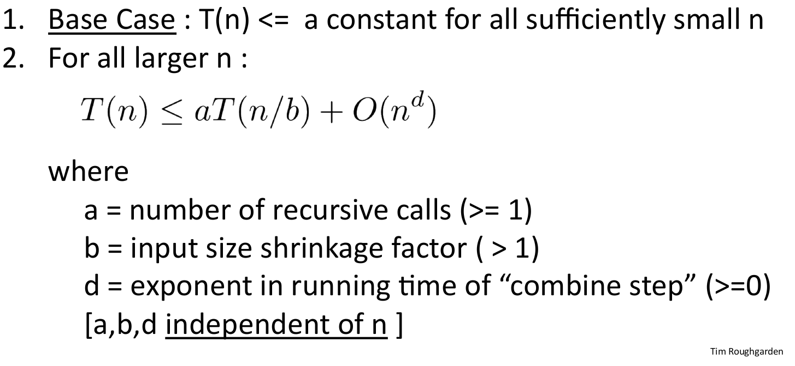

# Algorithms

## Guiding Principles for Analysis of Algorithms

1. Use worst-case analysis
2. Do not pay much attention to constant factors, lower-order terms
    * it is way easier
    * constants depend on architecture/compiler/programmer anyway
    * lose very little predictive power
3. Use asymptocit analysis (focus on large input sizes)
4. **Fast Algorithm** - worst-case running time grows slowly with input size
5. _Big O_ - **T(n) = O(f(n))** if and only if there exist constants c, k > 0 such that `T(n)<=cf(n)` for all `n >= k`

## The Divide and Conquer Paradigm

1. Divide into smaller subproblems
2. Conquer via recursive calls
3. Combine solutions of subpromlems into one for the original problem

## Counting inversions

1. _Inversion_ - when there is an array `a` and `a[i] > a[j] && i < j`

2. There are the following types of inversion:
  * _left inversion_ if `i, j <= n\2`
  * _right inversin_ if `i, j > n\2`
  * _split inversion_ if `i <= n\2 < j`

3. Pseudo code

  ```
  if n = 1 return 0
  else
    x = Count (1st half of a, n\2)
    y = Count (2nd half of a, n\2)
    z = CountSplitInversions (a, n)

    return x + y + z
  ```
3. _Key idea to count split inversion_: have recursive calls both count inversions and sort. _Motivation_: Merge subroutine naturally uncovers split inversions.

## The Master method

1. **Master method** - "black box" for solving recurrences.
2. _Assumption_: all subproblems have equal size
3. **`T(n)`** - maximum running time of the algorithm
4. **IF:**
    
    **THEN:**
    
