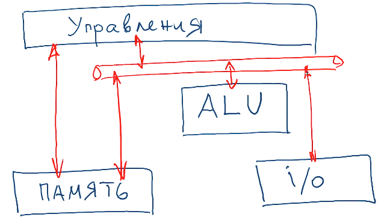

## Принципы Фон-Неймана
1. **Адрессность** - все данные хранятся в ячейках памяти. Каждая ячейка пронумерованна. Процессор может получить и записать данные в память используя адрес ячейки.
1. **Однородность памяти** - данные и команды хранятся в одой и той же памяти и не разделяются.
1. **Программное управление** - управление вычислительным процессом осуществляется посредством заранее загруженного в память сценария (программы). Программа представляет из себя набор последовательных инструкций и данных.
    1. На центральном процесоре существуют специальный указатель (Instruction Pointer), который указывает на адресс текущей исполняемой инструкции.
    1. Типы команд
        * Вычислительные: х + у, x or y
        * Запись/чтение из памяти
        * Команды переходов: переназначение на IP другого адреса

## Компоненты вычислительной системы
1. **Арифметико-логическое устройство (ALU)** - выполняет арифметические и логические операции
1. **Память** - обеспечивает хранение данных и инструкций
1. **Устройство ввода-вывода** - обеспечивает связь с внешним миром
1. Устройство управления
1. Все устройства соединины между собой шинами (может быть как для двух устройств, так и для т)

    

1. Память и CPU связанны между собой 2 шинами:
    * Шина данных - служит для передачи данных
    * Шира адреса - служит для установки адреса по которому нужно прочитать\записать данные.

        

1. [Пример работы вычислительной системы](https://stepik.org/lesson/13483/step/5?unit=3639)
