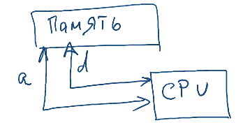
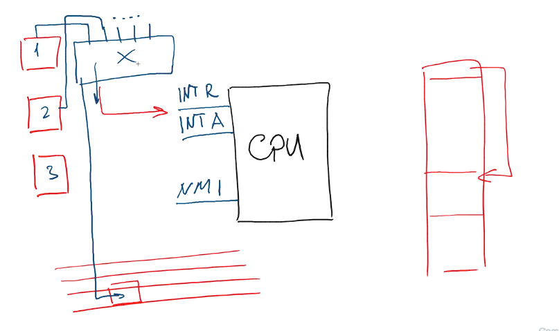

# Архитектура вычислительной системы.

- [Принципы Фон-Неймана](#%D0%BF%D1%80%D0%B8%D0%BD%D1%86%D0%B8%D0%BF%D1%8B-%D1%84%D0%BE%D0%BD-%D0%BD%D0%B5%D0%B9%D0%BC%D0%B0%D0%BD%D0%B0)
- [Компоненты вычислительной системы](#%D0%BA%D0%BE%D0%BC%D0%BF%D0%BE%D0%BD%D0%B5%D0%BD%D1%82%D1%8B-%D0%B2%D1%8B%D1%87%D0%B8%D1%81%D0%BB%D0%B8%D1%82%D0%B5%D0%BB%D1%8C%D0%BD%D0%BE%D0%B9-%D1%81%D0%B8%D1%81%D1%82%D0%B5%D0%BC%D1%8B)
- [Организация ввода-вывода](#%D0%BE%D1%80%D0%B3%D0%B0%D0%BD%D0%B8%D0%B7%D0%B0%D1%86%D0%B8%D1%8F-%D0%B2%D0%B2%D0%BE%D0%B4%D0%B0-%D0%B2%D1%8B%D0%B2%D0%BE%D0%B4%D0%B0)
- [Прерыванияя](#%D0%BF%D1%80%D0%B5%D1%80%D1%8B%D0%B2%D0%B0%D0%BD%D0%B8%D1%8F%D1%8F)

## Принципы Фон-Неймана
1. **Адрессность** - все данные хранятся в ячейках памяти. Каждая ячейка пронумерованна. Процессор может получить и записать данные в память используя адрес ячейки.
1. **Однородность памяти** - данные и команды хранятся в одой и той же памяти и не разделяются.
1. **Программное управление** - управление вычислительным процессом осуществляется посредством заранее загруженного в память сценария (программы). Программа представляет из себя набор последовательных инструкций и данных.
    1. На центральном процесоре существуют специальный указатель (Instruction Pointer), который указывает на адресс текущей исполняемой инструкции.
    1. Типы команд
        * Вычислительные: х + у, x or y
        * Запись/чтение из памяти
        * Команды переходов: переназначение на IP другого адреса

## Компоненты вычислительной системы
1. **Арифметико-логическое устройство (ALU)** - выполняет арифметические и логические операции
1. **Память** - обеспечивает хранение данных и инструкций
1. **Устройство ввода-вывода** - обеспечивает связь с внешним миром
1. Устройство управления
1. Все устройства соединины между собой шинами (может быть как для двух устройств, так и для т)

    

1. Память и CPU связанны между собой 2 шинами:
    * Шина данных - служит для передачи данных
    * Шира адреса - служит для установки адреса по которому нужно прочитать\записать данные.

        

1. [Пример работы вычислительной системы](https://stepik.org/lesson/13483/step/5?unit=3639)

## Организация ввода-вывода
1. Процессор связан с памятью по средством шины.
1. Набор адресов на шине - это адресное пространство.
1. Адресное пространство шины больше чем адресное пространство памяти. К примеру у шины [0, FFFF], причем память занимает только пространство [1FFF, FFFF].
1. Часть адресного пространства не связанного с физической памятью используется для ввода\вывода. (К примеру [0000, 00FF]).
1. Выделяеют два способа организации i\o.
    * На адресной шине устанавливается номер порта, который соответствует устройству. После этого данные переданные по шине данных идут к устройству.
    * Часть не занятого адресного пространства шины мапится на память устройств. При передачи данных по адресам из этого пространства, данные передаются к соответствующему устройству.

## Прерыванияя
1. **Прерывание** - специальный сигнал процессору, который оповещает его о каком-то внешнем событии.
1. Когда происходит прервывание, процесор, последовательно читающий инструкции из памяти, заканчивает выполнение текущей команды и переходит к обработчику прерываний.

    

1. Прерывания бывают:
    * Синхронные - возникают внутри процессора и связанны с ошибками внутренней логики. К примеру, обращение по указателю к несуществующей памяти, деление на 0 и т.д.
        * Подаётся сигнал на контакт **NMI**
        * Процессор безусловно прерывает свою работу
        * Процессор переходит к обработчику прерывания
    * Асинхронные (внешние) - сигналы приходящие от других устройств.
        * Внешнее устройтво подаёт сигнал на контакт **INT R** и ждёт когда процессор будет готов его обработать
        * В этот момент на шине данных выставлен номер обработчика прерываний
        * Когда процессор готов обработать данное прерывание он подаёт сигнал на **INT A** и вызвыает обработчик взяв адрес из шины.
    * Программные - иногда выполняемая на CPU программа требует помощи других устройств (к примеру вывести данные на экран), тогда программа может попросить процессор прерваться и вызвать обработчик прерывания.
1. Контроллер прерываний служит для того чтобы упорядочивать работу нескольких устройств. К тому же, у процессора всего 3 контакта для прерываний, а устройств может быть много.
    * Устройства подсоединяются к контроллеру, контроллер к процессору
    * Когда устройство посылает сигнал на контроллер прерываний, контроллер выставляет на адресной шине номер устройства и посылвает на процессор сингнал на **INT R** контакт
    * Процессор получает по номеру устройства его обработчик прерывания и выполняет его когда будет возможность.
1. Таблица в которой хранятся адреса обработчиков прерываний называется _таблицей прерываний_. Один ряд такой таблицы называется _вектором прерывания_.

## Процесс загрузки ОС
1. Когда включается PC начинает работать тактовый генератор.
1. Процессор "просыпается" и начинает выполнять программу старта (программа и её адрес зашиты на этапе производства)
1. Программа старта состоит из
    * POST (Power-On Selft-Test) - набор примитивных тестов, дающих ответ на вопрос - готова ли система начать загружаться.
    * BIOS (Basic Input Output System)
        * Определить какие устройства есть
        * Пронумировать устройства на шинах
        *
