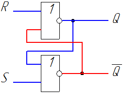
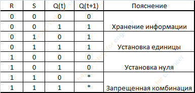
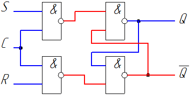
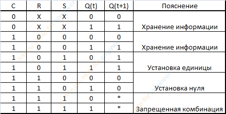
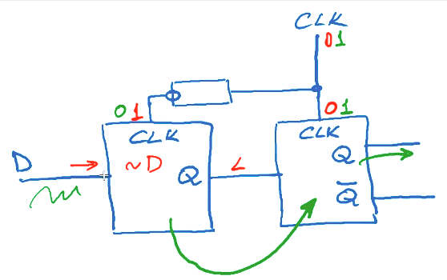

# Электронные компоненты

## Асинхронный RS триггер
1. Схема

    

1. Таблица истиности

    

## Синхронный RS триггер
1. Схема

    

1. Таблица истинности

    

## Двухкаскадная защёлка
1. Для того чтобы невелировать скачки напряжения установка сигнала происходит в два этапа через двух каскадную защёлку (состоит из 2 синхронных RS триггеров и элемента NOT)

    

1. При такой схеме установка сигнала происходит в два этапа.
    1. Устанавливается сигнал для сохранения
    1. Сигнал сохраняется

## Тактовый генератор
1. **Тактовый генератор** - элемент генерирующий постоянные импульсы, которые доступны всем элементам входящим в схему.
    * Одни элементы выполняют обработку сигнала на своих входах и вычисляют значение (логические элементы)
    * Другие меняют состояние в зависимости от напряжения на входах (RS-триггер)

## Литература
1. [Принцип работы RS-триггеров](https://h4e.ru/nizkovoltnaya-apparatura/131-printsip-raboty-rs-triggera)
1. [Урок на stepik](https://stepik.org/lesson/13482/step/6?unit=3638)
