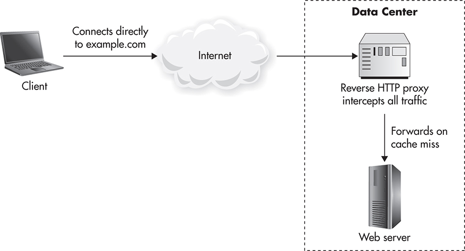

# Caching

## Hit Ratio
1. **Cache Hit Ratio** = cacheHitCount / (cacheHitCount + cacheMissCount)
1. **Relative performance** = 1 / (cacheHitCost * cacheHitRatio + cacheMissCost * (1 - cacheHitRatio))
1. Factors which affect cache hit ratio
    1. Key Space - how many possible keys do we have
    1. Cache Size - how many object can we store
    1. Key TTL

## HTTP Cache
1. [MDN HTTP Caching](https://developer.mozilla.org/en-US/docs/Web/HTTP/Caching)
1. Static files headers

    

1. Non cachable objects HTTP headers

    

1. Private files cache headers

    

1. Best Practices
    * do not use Cache-Control: max-age and Expires together, because it creates confusing behaviour
    * Do not use html caching metadags (like http-equiv="cache-control"). Again it dublicates cache logic and creates confusing behaviour

## Cache Types
1. Browsers Cache
1. Caching Proxy - setup up by enterprice companies or ISP.
    * this type of proxies loses popularity because of wide spreading of HTTPS (now proxies can not decrypt headers to examine traffic)

    

1. Reverse Proxy
    * public

        

    * private

        

1. CDN

    
