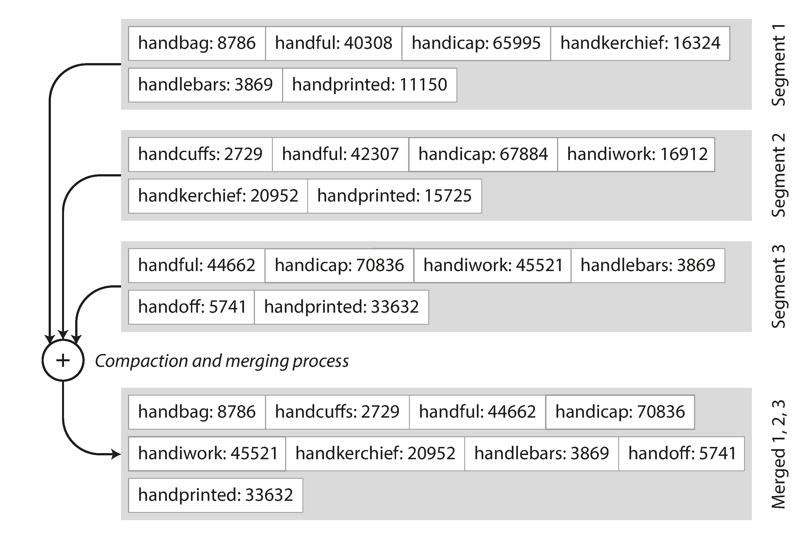

# Storage

## Log-Structured Storage
1. Always append new values to the log file. As a result this log file is immutable.
1. Maintain the hash table, where the value is offset in this log file.
1. To delete item append delete marker to the log file.
1. As long as you are able to store the hash table in memory - you will have tromendous performance.
1. Perform comprassion (removing overriden values) in background.
1. Pros:
    * Only sequential IO
    * As the workload is mostly IO bound - we could have the single thread and do not worry about concurrency.
1. Cons:
    * Effective only if you are able to have the whole hashtable in memory.
    * Range queires are not effective.

## SSTables and LSM-Trees
1. **S**orted **S**tring **Table** - similar to log-structured storage, but stores keys in sorted order.
1. Pros:
    * More efficient segments merge
        
    * We do not need to store the whole hash map in memory, because we could pretty easyly find key in data file (as they are sorted, and we already have some keys in memory) and cache it for future access
        ![SSTable Find Key)(./img/sstable-find-key.png)
1. Cons:
    * We need to keep keys sorted:)
1. How to maintain keys sorted:
    * We keep all the writes in some sorted structure in memory (e.g. AVL or red-black tree)
    * Once memtable gets bigger than threshold we write it out to disk
    * In order to serve a read request, try to find it in the memtable, then in the most recent disk segment, then the next recent and so on.
    * Run merging and comprassion process in background
    * To make writes durable maintaint separate log file on disk, where you add all the write operations sequentially.
1. Performance Optimization:
    * Maintain Bloom-Filter in memory to store if the key exists in segment file or not.
1. **L**og-**S**tructured **M**erge-**Tree** (LSM-Tree) - is data structure based on the above principles.

## B-Trees

## Page-Oriented databases

## Memory Databases

## OLTP

## DataWarehouse

## OLAP

## Column-Oriented databases

