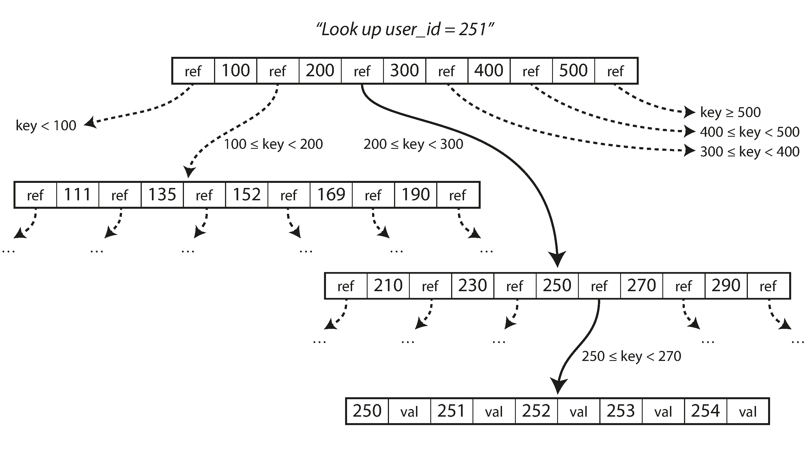

# Storage

## Log-Structured Storage
1. Always append new values to the log file. As a result this log file is immutable.
1. Maintain the hash table, where the value is offset in this log file.
1. To delete item append delete marker to the log file.
1. As long as you are able to store the hash table in memory - you will have tromendous performance.
1. Perform comprassion (removing overriden values) in background.
1. Pros:
    * Only sequential IO
    * As the workload is mostly IO bound - we could have the single thread and do not worry about concurrency.
1. Cons:
    * Effective only if you are able to have the whole hashtable in memory.
    * Range queires are not effective.

## SSTables and LSM-Trees
1. **S**orted **S**tring **Table** - similar to log-structured storage, but stores keys in sorted order.
1. Pros:
    * More efficient segments merge
        
    * We do not need to store the whole hash map in memory, because we could pretty easyly find key in data file (as they are sorted, and we already have some keys in memory) and cache it for future access
        
1. Cons:
    * We need to keep keys sorted:)
1. How to maintain keys sorted:
    * We keep all the writes in some sorted structure in memory (e.g. AVL or red-black tree)
    * Once memtable gets bigger than threshold we write it out to disk
    * In order to serve a read request, try to find it in the memtable, then in the most recent disk segment, then the next recent and so on.
    * Run merging and comprassion process in background
    * To make writes durable maintaint separate log file on disk, where you add all the write operations sequentially.
1. Performance Optimization:
    * Maintain Bloom-Filter in memory to store if the key exists in segment file or not.
1. **L**og-**S**tructured **M**erge-**Tree** (LSM-Tree) - is data structure based on the above principles.

## B-Trees
1. Lookup in B-Tree index
    

1. BTree add new key
    

## LSM-Trees v B-Trees
1. LSM-Tree advantages:
    * Better write performance
        * Altough both LSM-Trees and B-Trees maintain WAL, in addition to this LSM-Trees have not a lot of big sequential IO operations (dump memtable to disk or merge segments). On the other side, B-Trees need to flush pages on disk (which is random IO).
    * Write amplification is much less for LSM-Trees (because of only sequential IO)
    * The nature of write operations is not so important for SSD disks, but write amplification is critically important due to erase by block operations.
1. LSM-Tree disadvantages:
    * Worse read performance
        * In B-Tree keys are stored only in one place, do not need to traverse segments
    * Compression events could unpredictably influence database performance
    * Support only lookups by key and keys range, while B-Tree databases supports any kind of lookups.

## OLTP vs OLAP
| **Property**         | **OLTP**                                          | **OLAP**                                  |
|----------------------|---------------------------------------------------|-------------------------------------------|
| Main Read pattern    | Small number of records per query, fetched by key | Aggregate over large number of records    |
| Main write pattern   | Random-access, low-latency writes for user input  | Bulk import or event stream               |
| Primary used by      | End user/customer, via web applications           | Internal analyst, for decision support    |
| What data represents | Latest state of data (current point in time)      | History of events that happened over time |

## DataWarehouse
1. Used as a separate datastore to perform not-critical analytics queries
1. Stream data example:
    [Data Warehouse Streaming](./img/data-warehouse-streaming.png)
1. For analytics queires it's usefull to store data in formats like **start**
    [Data Warehouse Start](./img/data-warehouse-start.png)

## Column-Oriented databases

