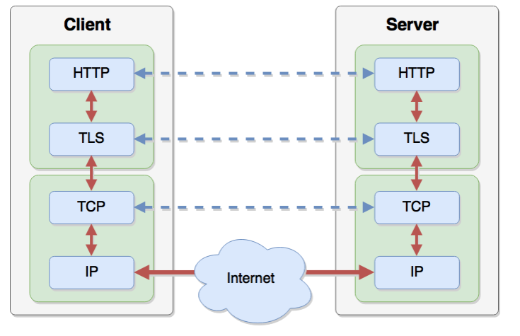

# Networking

## Arhitectual Design Principles
1. **Shared use of single communication chanell.**
    1. _statical multiplexing / packet switching_ - information for forwarding traffic contained in destination address of packet. It allows many senders to send data simultaniously via shared link
1. **Interconnet many existing networks. Hide underlying technology from applications**.
    1. Physical layer (sonet).
    1. Link Layer (Ethernet). Provides point to point connectivity.
    1. Network layer (IP). If a host has an IP address then Network Layer provides guarantee that a packet with host destination IP address, should reach the destination with the corresponding ip address.
    1. Transport layer (TCP, UDP). Gurantee: reliable transport, congestion control
    1. Application layer (HTTP, SMTP)
1. Survivability. Network works even if some devices fail.
    1. replication
    1. fate sharing. If a device failes then all its state fails with it.
1. Heterogeneity.
1. Distributed Management.
1. Network should be dump and minimal and _end points_ should be intelligent.

## Стэк сетевых протоколов

1. `HTTP` и `TLS` реализованна в браузере или веб сервере
1. `TCP` и `IP` реализованна в ОС
1. Порядок работы на клиенте:
    1. `HTTP`: формируется запрос. Вызывает функцию протокола `TLS`.
    1. `TLS`: шифрует данные, вызывает функцию протокола `TCP`.
    1. `TCP`: добавляет контрольные суммы, делит на сегменты если это нужно, ставит свои флаги и передаёт данные протоколу более нижнего уровня (`IP`)
    1. `IP`: передача данных через сеть интернет
1. Порядок работы на сервере: `IP` => `TCP` => `TLS` => `HTTP`.

## Common
1. **`traceroute`** - tracks  the route packets taken from an IP network on their way to a given host.

    ```bash
    $ traceroute google.com
    traceroute to google.com (173.194.44.72), 30 hops max, 60 byte packets
        1  192.168.10.1 (192.168.10.1)  0.282 ms  0.268 ms  0.396 ms
        2  bsr02.tomsk.ertelecom.ru (109.194.32.69)  2.716 ms  2.886 ms  3.306 ms
        3  lag-2-436.bgw01.tomsk.ertelecom.ru (109.194.40.22)  1.259 ms  1.449 ms  1.462 ms
        4  72.14.215.165 (72.14.215.165)  41.599 ms  47.736 ms  41.773 ms
        5  72.14.215.166 (72.14.215.166)  41.787 ms  41.766 ms  41.761 ms
        6  66.249.94.94 (66.249.94.94)  42.176 ms  41.686 ms  41.857 ms
        7  108.170.232.47 (108.170.232.47)  42.602 ms  42.585 ms  42.903 ms
        8  173.194.44.72 (173.194.44.72)  42.846 ms  42.518 ms  42.616 ms
    ```

1. To show a machine IP address:

    ```bash
    ip addr show
    ```
    ```bash
    ifconfig
    ```

1. To ping a server use

    ```bash
    ping | -c count |  <server>
    ```

1. To send an HTTP request with netcat use:

    ```bash
    printf 'HEAD / HTTP/1.1\r\nHost: <host>\r\n\r\n' | nc <server> <port>
    ```

1. To listen to a port with netcat use

    ```bash
    nc -l <port>
    ```

1. To get an information about domain use

    ```bash
    dig <domain>
    ```
