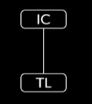

# Incident Management

## Timeline

## Challenges
1. No one responding
1. Not the right people
1. Solving the wrong problem
1. People making things worse
1. Too many people involved
1. Stackeholders left in the dark
1. Everyone stepping on each other toes.

    

## Best Practices
1. We should have two modes of operations with a clear distinction between them
    * **Normal Operations**
    * **Emergency Operations**
1. Have different **severities** for incidents
1. Practice, practice, practice, then practice some more.

## Incident Command System Principles
1. **Common terminology** - everyone in the team should use the same terms.
1. **Accountability** - everyone participating in an incident takes responsibility for resolving it as a first priority.
1. **Unity of command** - the is a single chain of commands to an incident commander.
1. **Explicity transfers of responsibility** - you should get an explicit confirmation when transfer roles.
1. **Modular organization** - [separate into roles](#incident-org-chart)
1. **Integrated communication** - haven defined common communication streams.

**If you're just learning incident response, you can go far by guessing the right thing to do based on 'what whould the fire department do in this situation?'** (c) J. Paul Reed
1. What would there on-call schedule be?
1. Would they stop everything for a press conference in the middle of an incident?
1. Would the mayour come in and take over the incident and tell the team exactly what to do?

## Incident org chart

Definitions:
* **IC** - Incident Commander
* **TL** - Tech Lead
* **SME** - Subject Matter Expert (firefighter)
* **Comm** - Communication Lead (communicate with users, stackholders and executives)
* **Scribe** - document what is going on

Important:
    * **Focus on roles, not indivisuals.**

People involve as incident grows:

1. Start of an incident

    

    * Usually IC is an on-call person
    * IC at start fullfil all the roles, including comminication and scribe
    * IC could **explicitly** transfer this role later

1. Escalate and involve more firefighters

    

1. Add more visibility to the users

    

1. Add more firefighters

    

