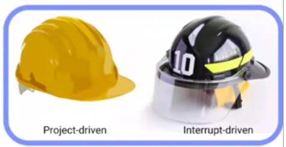

# On-Call

## Balance Interrupt Work and Project work
1. Be project driven, not interrupt-driven
    

1. The on-call makes sure that the issue is fixed
1. Let everyone's else work to be uninterrupted
1. If nobody is oncall it means that everyone is oncall.
1. The rotation schedule prevents burnout.

## Dealing With Page Overload
**Reduce the amount of the bellow issues**

### Pager Load Sources
1. Production
    * exited bugs
    * introduction of new bugs
    * the speed which newly introduced bugs are identified
    * the speed which bugs are mitigated and removed from production
1. Alerting
    * alerting thresholds that trigger a paging alert
    * introduction of new paging alerts
1. Human processes
    * the rigor of fixes and follow-up on bugs
    * the quality of data collected about paging alerts
    * the attention paid to pager load trends
    * human-actuated changes to production

### Reducing the page overload
1. Cleanup noisy alerts
1. Implement serverity levels
    * page
    * ticket
1. Automate what can be automated.
