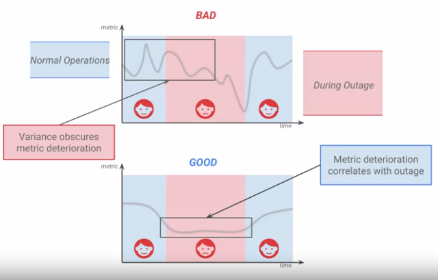
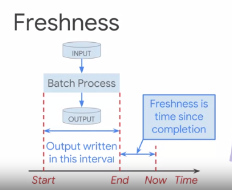

# SLI, SLO, SLA

* [Definitions](#definitions)
  + [Specification vs Implementation](#specification-vs-implementation)
* [SLI Specification](#sli-specification)
  + [How good SLI looks like](#how-good-sli-looks-like)
  + [Request / response SLI](#request--response-sli)
  + [Data Processing SLI](#data-processing-sli)
  + [Storage SLI](#storage-sli)
* [SLI Implementation](#sli-implementation)
  + [Request/Response Sources of data](#requestresponse-sources-of-data)
  + [Pipeline processing source of data](#pipeline-processing-source-of-data)
  + [Setting SLOs](#setting-slos)
  + [Managing Complexity](#managing-complexity)

## Definitions
1. **Service Level Indicator (SLI)** - the quantitative measurement of user happines
1. **Service Level Objective (SLO)** - the threshold on SLI when users are happy. Should be adjusted over time. internal promise to meet customers objectives. Should be stronger than SLA, because usually customers are affected much earlier than the SLA breach.
1. **Service Level Agreement** (SLA) - promise to customers, if this promise is failed there are financial (or other) consequences.

    

### Specification vs Implementation
1. **SLI Specification** - what are you going to measure
1. **SLI Implementation** - how are you going to measure it.
    * There could be multiple implementations of the same specification

## SLI Specification

### How good SLI looks like
1. It should be measurable and meningfull by user
1. It should be quantifiable
1. It should be close to user expirience (users do not care if your database is down or if the load balancer is overloaded, from their perspective the website is down or slow)
1. It should be stable without a big variance

### Request / response SLI
1. **Availability** - the proportion of valid requests served successfully
1. **Latency** - the proportion of valid requests served faster than a threshold. Should be set on the long tail. For example 99% of the requests should be served within 100ms. But it's always worth to consider other percentiles like (75%, 90%, 95%).
1. **Quality** - the proportion of valid requests served without degrading quality. For example in case of an outage you could serve stale requests from cache. In this case, you still fullfill latency and availability SLI, but you work with degraded quality.

### Data Processing SLI
1. **Freshness** - the proportion of valid data updated more recently than a threshold.
    * for batch processing

        

    * for stream processing

        

1. **Correctness** - the proportion of valid data producing correct output. The measurement of correctness should be independent from the code calculating data, otherwise in case when the result is incorrect we will still count it as correct one.
1. **Coverage** - the proportion of valid data processed successfully (similar to availability for request/response).
1. **Throughput** - the proportion of time where the data processing rate is faster than a threshold (similar to latency for request/response). Easy to explain in bytes per second, the system should expose this metric.

### Storage SLI
1. **Availability**
1. **Latency**
1. **Durability**

## SLI Implementation
### Request/Response Sources of data
1. Application server logs
1. Load balancer monitoring
1. Black-box monitoring
1. Client-side instrumentation

### Pipeline processing source of data
1. Queries from database.
    * it could be required to store some additional information in DB to get the SLI for data processing apps

### Setting SLOs
1. Steps
    * Decide who are the users of your application
    * Choose an **SLI specification for the menu** - high-level descriptions of a dimension of reliability that we would like to measure about our service, ideally taking the form "the proportion of valid events that were good"
    * Define **SLI Implementations** - concrete definitions of what the events are, what makes them valid for inclusion into the SLI, what makes them good, and how/where they are measured
    * Walk through the user journey and look for coverage gaps.
    * Set aspirational SLO targets based on business needs.
1. **Achievable targets** - represent past performance. It's good to start from historical data when you first set your SLO.
1. **Aspirational targets** - represent business needs. When you set your SLO based on historical data you can not be sure that customers are happy with it (but anyway it's a good start). So once you set historical SLO work with your businees to set Aspirational SLOs. Keep in mind the faster you want to build - the more expensive it is.
1. Coninually improve your SLO until then good enough for user happinest.
1. Users happinest depends on past expirience. If you performed extremely well, than degraded performance a little bit => user will be unhappy.

### Managing Complexity
1. It's best to have 1-3 SLI for each user journey.
    * Not all metrics make good SLIs.
    * More SLIs result in higher cognitive load.
    * More SLIs lower signal-to-noise ratio.
1. Priorotize only journey that have significant impart on user expirience.
1. Usually we have much more metrics than SLI
    * SLIs tell us that something went wrong
    * Metrics tell us what exactly went wrong
1. It is usefull to devide thresholds up to 3 buckets:
    * background processing (the highest latency treshold, e.g. 5s)
    * write response (e.g. 1.5s because users are use to have writes slover than read)
    * interactive response (~0.4s)

## Documenting SLO
1. Every SLO should contain the following:
    * Why the threshold is where it is
    * Why the SLIs are appropriate for measuring the SLO.
    * Identify monitoring data deliberately excluded from SLIs
1. Keep SLOs documentation in version control
    * ideally next to the monitoring configurations, so that everything is in one place
