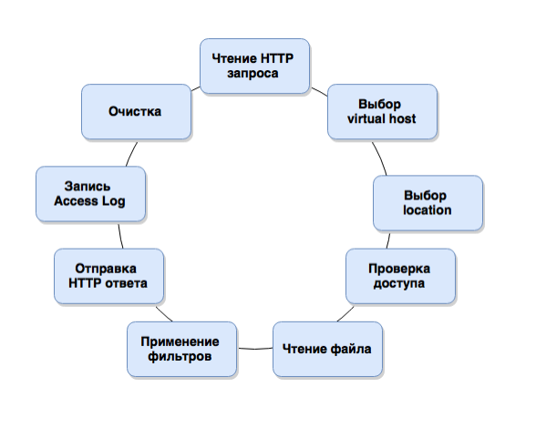

# Web Servers

## Table of content
- [Виды вебсерверов](#Виды-вебсерверов)
- [Процессы web сервера](#Процессы-web-сервера)
- [Модульная архитектура](#Модульная-архитектура)

## Виды вебсерверов
1. Apache
1. Nginx
1. IIS7
1. LightTPD

## Процессы web сервера
1. Master (user: root, 1 процесс)
    * чтение и валидация конфига
    * открытие сокета (ов) и логов
    * запуск и управление дочерними процессами (worker)
    * Graceful restart, binary updates
1. Worker (user: www-data or no-body, 1+ процессов)
    * обработка сетевых запросов

## Цикл обработки запроса

1. Чтение HTTP запроса из соединения (соединение предоставляет master процесс)
1. Выбор virtual host (на основе заголовка `Host`)
1. Выбор location и определение пути к файлу который нужно отдать.
1. Проверка доступа к отдаваемому файлу
1. Чтение файла с диска
1. Применяем выходные фильтры (сжатие gzip, разбитие на части в случае большого документа)
1. Отправка HTTP ответа
1. Запись Access Log
1. Очистка выделенной для обработки запроса памяти.

## Модульная архитектура
1. У большинства популярных веб-серверов существует модульная архитектура. Т.е. есть ядро и опционально подключаемые модули.
1. Задачи ядра:
    * открытие\закрытие соединений
    * обработка http запросов по циклу описанному выше
1. Модули можно подключать динамически. Модуль добавляет некоторые опции в конфиг веб сервера и добавляет некоторые middleware на каком-либо этапе обработки запроса.
